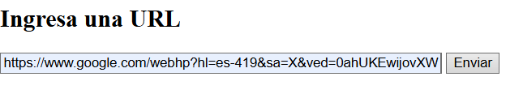

# Networking
Juan Sebastian Velandia 20/06/2025

##Exercise 1

For the first exercise i'm going to write a program that creates a URL object and prints each one of this methods:
-getProtocol
-getAuthority
-getHost
-getPort
-getPath
-getQuery
-getFile
-getRef

And the program is this:

So the output with the command java src\main\java\edu\escuelaing\arsw\App.java:

## Excercise 2
### 1. HTML Form (Frontend)

A basic HTML form is provided to allow the user to input a URL. When the form is submitted, it sends an HTTP `GET` request to the Java server at the `/descargar` endpoint, including the user-provided URL as a query parameter.

### 2. Java HTTP Server (ServerSocket)

The Java backend creates a simple HTTP server using `ServerSocket` that listens for incoming connections on port `8080`.

### 3. Handling Requests and Extracting the URL

Once a connection is established, the server reads the HTTP request. If the request matches the `/descargar` endpoint, it extracts the `url` parameter from the request line using basic string parsing.

### 4. Connecting to the URL and Reading HTML

With the extracted URL, the server creates a `URL` object and opens a stream to read the HTML content line by line. The content is stored in a `StringBuilder` and then written to a file named `resultado.html`.

### 5. Sending a Response and Closing the Socket

After saving the HTML, the server sends a basic HTTP response back to the browser indicating success. Finally, it closes the connection.

## Output

-First we run the program:

- We open the form in a browser:

- After we send it, the file resultados.html will be find on the proyect folder:

- And that file, shows:

- The HTML content of the specified URL is saved as a local file named `resultado.html`.
- This file can be opened manually in a web browser to view the downloaded page.

## Notes

- The server does not use threads or any form of concurrency, as per the assignment instructions.
- The application only handles one connection at a time and is designed for local use and testing purposes.

